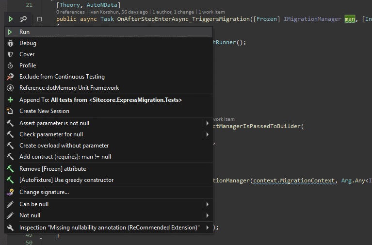

# ReSharper Helpers
Plugin to extend R# functionality by set of custom actions.

## Features:

#### Copy full class name
Quick action to copy full class name (including assembly name) to clipboard.

#### Cleanup modified file
Extend solution context menu with additional action to perform cleanup on modified files only. Action uses git to get list of modified files. All dirty files (indexed and non-indexed) are included.

#### Suppress warnings for project
Now you can use `[assembly: SuppressMessage("ReSharper", "id")]` attribute to suppress inspection warnings on project level. It might be useful for the test projects where not all inspections are relevant.

Note, you might need to reload solution and re-analyze files to apply changes.

#### Assert parameter is not null/Assert all
Quick action for method argument to insert assertion statement. Allows to assert all nullable argument using `Assert all` action.
If annotation attributes are available and relevalt for argument, they are arranged.

#### [Pure] annotation
Quick actions to add/remove `Pure` annotation attribute.

#### Chop/one line method arguments
Quick actions to chop method arguments or make them one line (remove all line breaks).
Useful to format method signatures with large number of parameters (e.g. in tests).

#### AutoFixture: [Freeze, Greedy] quick actions
Quick actions to add/remove `[Frozen]` or `[Greedy]` attributes for [AutoFixture xunit integration](https://github.com/AutoFixture/AutoFixture). Allows to specify match criteria for the `[Frozen(Matching.XXX)]` attribute.

#### Create test file/Go to test file
Quick action to go to corresponding test file or create it. Usually, test project name is detected automatically, but could be configured in plugin settings (in R# options dialog). 

To specify individual test project for your projects, specify `[assembly: AssemblyMetadata("ReSharperHelpers.TestProject", "TEST_PROJECT_NAME")]` attribute. Define attribute conditionaly (e.g. `#if DEBUG .... #endif`) if you want to omit attributes in release assembly. Note, if condition is not satisfied, attribute might be not detected by plugin.

#### Navigate to next/prev section in bulb menu
When bulb menu is opened (e.g. after you press `Alt+Enter`), you can use `Ctrl` + `Up/Down` to navigate to next section. Useful if quick actions menu becomes really large.  
If section is very large, it jumps to the middle of the section before jumping to the next/previous one.

#### "Build and run solution" build configuration
Custom [R# Build Configuration](https://blog.jetbrains.com/dotnet/2015/10/15/introducing-resharper-build/) that builds solution and runs it. The difference comparing to default build configuration (VS Startup) is that by default startup project (with all dependencies) is built rather than solution. If you have projects which you want to be always built, they might be skipped if your startup project doesn't depend on them.

It might be useful when you develop a custom plugin that depends on startup project. You might want the plugin to be always built and copied to startup project output directory. In this scenario you:  

1. Mark plugin project as "Build always".
2. Create and activate "Launch Solution" build configuration in `Build & Run` window.

## Pre-release builds
Pre-release builds (develop branch) are published to [custom nuget feed](https://www.myget.org/feed/alexpovar-resharperhelpers-prerelease/package/nuget/AlexPovar.ReSharperHelpers). If you want to use pre-release builds, add the following NuGet package source to ReSharper: `https://www.myget.org/F/alexpovar-resharperhelpers-prerelease/api/v2`.
